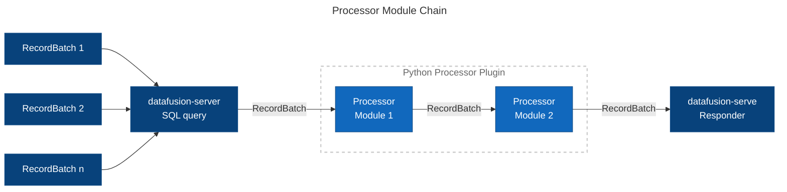

# Changelog

## 0.19.0 (Will be released soon)

* Integrates with external database engines
    + Example of PostgreSQL

config.toml

```toml
[[databases]]
type = "postgres"
namespace = "pg1"
user = "example"
password = "password"
host = "postgres.local"
port = 5432
ssl_mode = "disable"
database = "example"
description = "PostgreSQL"
```

Query

```sql
SELECT M.city AS city, SUM("superstore.Sales") AS sales
  FROM superstore, table1@pg1 M
 WHERE "superstore.City" = M.city
GROUP BY "superstore.City"
```

* Adds metric parameters for Prometheus
    + `memory_usage_bytes` and `virtual_memory_usage_bytes`
* Update latest crates dependencies

## 0.18.1 (2024-07-13) - Quick patch to keep up with the latest DataFusion crate

* Updates to DataFusion v40 and Arrow v52.1
    + https://github.com/apache/arrow-datafusion/blob/main/dev/changelog/40.0.0.md
    + https://github.com/apache/arrow-rs/blob/master/CHANGELOG.md#5210-2024-07-02

## 0.18.0 (2024-07-12)

* Adds `disable_stateful_features` setting to server configurations
    + Please refer to
      this [document](https://sal-openlab.github.io/datafusion-server/installation/using-crate/#configuration-parameters)
      for more details
    + It is intended to be a stateless container when running on clustering solutions such as Kubernetes
* The following metrics parameters have been added
    + `session_contexts_total`
    + `session_context_duration_seconds`
    + `data_source_registrations_total`
    + Please refer to
      this [document](https://sal-openlab.github.io/datafusion-server/installation/telemetry/#metric-names-and-labels)
      for more details
* Updates some latest crates dependencies

## 0.17.1 (2024-06-25)

* Missing functions and bug fixes
    + Since the `do_put` method of the Flight feature was not implemented
        - Available test client at `example/flight-client`
    + Exponential definitions for latency was not applied to metrics for the Flight feature methods

## 0.17.0 (2024-06-21)

* Metrics tracking and exposing for [Prometheus](https://prometheus.io/) integration
    + Please refer to this [document](https://sal-openlab.github.io/datafusion-server/installation/telemetry/)
      for more details
* Refactor object stores credentials to credential manager
* Resolved some warnings reported by clippy
    + `clippy-all.sh` to checks all features combination
* Support for specifying table versions (time travel feature) in Delta Lake
    + Specify the version of the Delta table in the data source definition under `options.version`
    + Please refer to the
      [documentation](https://sal-openlab.github.io/datafusion-server/data-source/delta-lake/#options)
      for more details on this as well

## 0.16.0 (2024-06-15)

* Delta Lake integration (currently read direction only)
    + For more details, please refer to
      this [documentation](https://sal-openlab.github.io/datafusion-server/data-source/delta-lake/)

## 0.15.2 (2024-06-11)

* Updates to DataFusion v39 and Arrow v52
    + https://github.com/apache/arrow-datafusion/blob/main/dev/changelog/39.0.0.md
    + https://github.com/apache/arrow-rs/blob/master/CHANGELOG.md#5200-2024-06-03
* Added `arrowcat` command line tool
    + Please refer to [README.md](tool/arrowcat/README.md) for details
* Removes deprecated legacy API endpoints
    + `/arrow/csv/:filename`
    + `/arrow/parquet/:filename`
    + `/json/csv/:filename`

## 0.15.1 (2024-05-29)

* Incorrect link to system diagrams in README.md

## 0.15.0 (2024-05-29)

* Added support for Microsoft Azure Blob Storage (`az://` or other scheme) and WebDAV (`http`, `https`) storages
    + Refer to this [documentation](https://sal-openlab.github.io/datafusion-server/data-source/object-store/) for
      object store configuration and usages
* Change the settings of `storages`.`type` for Google Cloud Storage from `gcs` to `gcp`

## 0.14.0 (2024-05-25)

* Added support for AWS and GCP object stores
    + AWS S3 (`s3://`)
    + Google Cloud Storage (`gs://`) _experimental_
    + Please refer to
      this [table](https://sal-openlab.github.io/datafusion-server/data-source/what-datasource/#data-source-format-and-location-matrix)
      for the correspondence between data source formats and locations
    + Refer to this [documentation](https://sal-openlab.github.io/datafusion-server/data-source/object-store/) for
      object store configuration and usages
* Fixed an issue where the schema for the `Map` data type was not being generated correctly

## 0.13.2 (2024-05-11) - Quick patch to keep up with the DataFusion crate

* Updates to DataFusion v38.0.0
    + https://github.com/apache/datafusion/blob/main/dev/changelog/38.0.0.md
* Accepts named session identifier in `/session/create` endpoint
    + It is now possible to specify any arbitrary identifier string instead of
      the generated UUID for the session ID
    + If the `id` query parameter is omitted, the behavior will be the same as before

```sh
$ curl http://127.0.0.1:4000/session/create?id=example-session1
```

This allows for session access using a named identifier.

```sh
$ curl -X POST http://127.0.0.1:4000/session/example-session1/query \
     -H 'Content-Type: application/sql'
     ...
```

## 0.13.1 (2024-05-10)

* Fixed an issue where locations for Parquet and CSV formats were not functioning correctly over http(s)

## 0.13.0 (2024-05-06)

* Generalized the transport layer across various data source formats including data source
  connector plugins
    + Please refer to this
      [document](https://sal-openlab.github.io/datafusion-server/data-source/what-datasource/#data-source-format-and-location-matrix)
      for a list of available data source formats and locations
    + This adaptation has made it possible to implement data source connector plugins that
      pass through data, such as SMB/CIFS clients (`bin/plugins/datasource-plugin-smb` for details)

```json
{
  "format": "parquet",
  "name": "population",
  "location": "smb://server/shred-folder/population.parquet",
  "pluginOptions": {
    "user": "foo",
    "password": "bar"
  }
}
```

* The session query endpoint (`/session/:id/query`) now supports `application/sql` in addition to
  the previously supported `application/json` in the request headers

```sh
$ curl -X POST http://127.0.0.1:4000/session/6d72252b-f8d7-4d5a-b73e-962ede7eea4f/query \
     -H 'Content-Type: application/sql' \
     -H 'Accept: text/csv' \
     -d $'
SELECT t1.foo, t2.bar, t2.baz
FROM table1 t1, table2 t2
WHERE t1.id = t2.id
ORDER BY t1.id
'
```

## 0.12.1 (2024-04-30)

* The content-type of multipart fields generated by a browser's form element cannot be specified,
  but files in Parquet format default to `application/octet-stream`
    + If the format cannot be determined from the content-type of a multipart field,
      it will be resolved based on the file name extension
* An example of selecting and uploading multiple files from a browser to the
  `example/multipart-uploader` directory has been provided

## 0.12.0 (2024-04-29)

* Direct file uploads from the client using multipart/form-data
    + POST `/session/:id/datasource/upload` endpoint
    + Supported formats are `text/csv`, `application/json` and `application/vnd.apache.parquet`
    + The maximum upload size is specified by `session.upload_limit_size` in config.toml (default is 20MB)

```sh
$ curl -X POST \
    -F "apis=@./bin/data/public-apis.parquet;type=application/vnd.apache.parquet" \
    -F "store=@./bin/data/superstore.csv;type=text/csv" \
    -F "james_bond=@./bin/data/james-bond.json;type=application/json" \
    http://127.0.0.1:4000/session/e4d8cd37-f9ee-4a5d-981b-2925167a3576/datasource/upload
```

## 0.11.1 (2024-04-23)

* Updates to DataFusion v37.1.0
    + https://github.com/apache/arrow-datafusion/blob/main/dev/changelog/37.1.0.md

## 0.11.0 (2024-04-18)

* Supports complex data types, such as  `List`, `Map`, `Struct` and others
    + Please refer to
      the [Documentation](https://sal-openlab.github.io/datafusion-server/data-source/definition-basics/#complex-data-types)
      for details
* [Breaking] The specifications for the following data type definitions have been changed due to the expansion of
  complex data types
    + Timestamp, TimestampSecond, TimestampMicro, TimestampNano
    + Duration, DurationSecond, DurationMicro, DurationNano
* Avro data source format supported

```sh
$ curl -X POST http://127.0.0.1:4000/dataframe/query \
     -H 'Content-Type: application/json' \
     -H 'Accept: text/csv' \
     -d $'
{
  "dataSources": [
    {
      "format": "avro",
      "name": "popular_names",
      "location": "file:///popular-names.avro"
    }
  ]
  "query": {
    "sql": "SELECT * FROM popular_names"
  }
}'
```

In this version, only read is supported, and save at the `/session/:id/datasource/save` endpoint is not possible.

## 0.10.2 (2024-04-13)

* Substantially reduced memory consumption during query execution given these conditions:
    + API endpoints are `/session/:id/query` and `/dataframe/query`, or Arrow Flight `do_get()` method
    + The response format is `arrow` (`application/vnd.apache.arrow.stream`)
    + No post-processor (`query.postProcessors` in request body) is specified
* Implements and refactored Arrow Flight gRPC methods:
    + `get_flight_info()`, `get_schema()`, `do_get()`
* Fixed an issue where the post-processor was not working at the `/dataframe/query` endpoint
* Published example code demonstrating how to use it:
    + Data visualization on the web using [Perspective Viewer](https://perspective.finos.org/), Can quickly and easily
      visualize Arrow responses from DataFusion Server
        - Located at `example/perspective-viewer` directory, Simply show `viewer.html` in a web browser
    + Arrow Flight command-line client
        - Located at `example/flight-client` directory, `cargo run` to show usages guide
* Lowered the MSRV to 1.74 and tested all features

## 0.10.1 (2024-04-05)

* Updates to DataFusion v35 and Arrow v51
    + https://github.com/apache/arrow-datafusion/blob/main/dev/changelog/36.0.0.md
    + https://github.com/apache/arrow-rs/blob/master/CHANGELOG.md#5100-2024-03-15
* And other related crates
    + Tonic v0.11.0

## 0.10.0 (2024-03-29)

* Initially supported Arrow Flight gRPC feature
* Query or query and response format schema can be specified for request body of endpoint `/:session/query`
* Updates latest crates dependencies
    + Tokio v1.37.0, axum v0.7.5, reqwest v0.12.2 and other crates

## 0.9.2 (2024-03-10)

* Changes argument of entry function from config file path to `struct` of `Settings`
    + Usage example in [README.md (Example of src/main.rs)](README.md#example-of-srcmainrs)
* Updates Python interpreter to v3.11.8 (pre-built Docker container)
* Updates pandas for processor plugin to v2.2.1 (pre-built Docker container)
    + Refactors Python plugin codes (example, excel, pivot-table)
* Updates some dependent crates

## 0.9.1 (2024-02-23)

* Updates latest crates dependencies
    + hyper v1.2.0, tower-https v0.5.2, pyo3 v0.20.3
* Fixes containers version obtaining file in make-containers.sh (to same as crate version)
* Updates README.md

## 0.9.0 (2024-02-21)

* Response format can now be specified via the `Accept` request header.
  If `response.format` is also specified in the request body, the request body takes precedence.
    + This applies to both the `dataframe/query` and `session/:session_id/query` endpoints.

In this example, specifying `csv` for `response.format` will result in the same response.

```sh
$ curl -X "POST" "http://127.0.0.1:4000/dataframe/query" \
     -H 'Content-Type: application/json' \
     -H 'Accept: text/csv' \
     -d $'{
  "dataSources": [
    {
      "name": "entry",
      "format": "parquet",
      "location": "file:///public-apis.parquet"
    }
  ]
  "query": {
    "sql": "SELECT * FROM entry"
  }
}'
```

If both `response.format` is specified in the `Accept` header and in the request body,
the specification in `response.format` takes precedence. In this example, the response will be returned in
Arrow format (`Content-Type: application/vnd.apache.arrow.stream`).

```sh
$ curl -X "POST" "http://127.0.0.1:4000/dataframe/query" \
     -H 'Content-Type: application/json' \
     -H 'Accept: application/json' \
     -d $'{
  "dataSources": [
    {
      "name": "entry",
      "format": "parquet",
      "location": "file:///public-apis.parquet"
    }
  ]
  "query": {
    "sql": "SELECT * FROM entry"
  },
  response: {
    "format": "arrow"
  }
}'
```

* Updates to DataFusion v36
    + https://github.com/apache/arrow-datafusion/blob/main/dev/changelog/36.0.0.md

## 0.8.16 (2024-02-20)

* Raw JSON is now called ndJSON (new-line delimited JSON), so the data source format specification was changed
  from `rawJson` to `ndJson`.
    + In conjunction with this change, the related sections have been changed.

E.g., Until now,

```json
{
  "dataSources": [
    {
      "format": "rawJson",
      "name": "table1",
      "location": "file:///Superstore.raw.json"
    }
  ]
}
```

From now on,

```json
{
  "dataSources": [
    {
      "format": "ndJson",
      "name": "table1",
      "location": "file:///Superstore.ndjson"
    }
  ]
}
```

The response format will still be suitable for `json`.

```json
{
  "response": {
    "format": "json"
  }
}
```

## 0.8.15 (2024-02-18)

* Wrong information was given in the README.md example. Very sorry...
    + `dataSources[*].location` requires scheme like a `file://`.

## 0.8.14 (2024-02-18)

* Updates to latest Tokio ecosystems
    + Prepare for the upcoming axum v1.0
        + Tokio v1.36, Hyper v1.1, axum v0.7.4
        + https://github.com/tokio-rs/axum/blob/main/axum/CHANGELOG.md#074-13-january-2024

## 0.8.13 (2024-01-27)

* Updates to DataFusion v35 and Arrow v50
    + https://github.com/apache/arrow-datafusion/blob/main/dev/changelog/35.0.0.md
    + https://github.com/apache/arrow-rs/blob/50.0.0/CHANGELOG.md
* And other crates updated

## 0.8.12 (2023-12-24)

* Updates to DataFusion v34 and Arrow v49
    + https://github.com/apache/arrow-datafusion/blob/main/dev/changelog/34.0.0.md
    + https://github.com/apache/arrow-rs/blob/49.0.0/CHANGELOG.md
        - Changed result value of `json::reader::infer_json_schema_from_seekable`.
* And other crates updated

## 0.8.11 (2023-11-17)

* Updates to DataFusion v33 and Arrow v48
    + https://github.com/apache/arrow-datafusion/blob/main/dev/changelog/33.0.0.md
    + https://github.com/apache/arrow-rs/blob/48.0.0/CHANGELOG.md
        - `arrow_csv::WriterBuilder::has_headers` and `arrow_csv::ReaderBuilder::has_header` has been deprecated,
          use `with_header` instead.
* And other crates updated

## 0.8.10 (2023-10-14)

* Updates to DataFusion v32 and Arrow v47
    + https://github.com/apache/arrow-datafusion/blob/main/dev/changelog/32.0.0.md
        - `SessionContext::with_config` has been deprecated, use `new_with_config` instead.
    + https://github.com/apache/arrow-rs/blob/47.0.0/CHANGELOG.md
* Updates to Tokio v1.33
    + https://github.com/tokio-rs/tokio/blob/master/tokio/CHANGELOG.md#1330-october-9-2023
* Addressed Clippy v0.1.73 warning: 'matching over () is more explicit'.

## 0.8.9 (2023-09-23)

* Prepared DataFusion Server to run in standalone and Docker environments

## 0.8.7 (2023-09-22)

* Internal version number under adjustment was skipped
* In the meantime, documentation and sample data were organized

## 0.8.4 (2023-09-16)

* Updates to DataFusion v31 and Arrow v46
    + https://github.com/apache/arrow-datafusion/blob/main/dev/changelog/31.0.0.md
    + https://github.com/apache/arrow-rs/blob/46.0.0/CHANGELOG.md

## 0.8.3 (2023-09-03)

* Refactored CSV relatives
    + Drop deprecated date format parser options
    + Response by CSV format were supported

## 0.8.2 (2023-08-26)

* Updates to DataFusion v30 and Arrow v45
    + https://github.com/apache/arrow-datafusion/blob/main/dev/changelog/30.0.0.md
    + https://github.com/apache/arrow-rs/blob/45.0.0/CHANGELOG.md
    + DataFusion v29 was not officially released, but all changes are applied in v30
        - https://github.com/apache/arrow-datafusion/blob/main/dev/changelog/29.0.0.md
        - https://github.com/apache/arrow-rs/blob/44.0.0/CHANGELOG.md

## 0.8.1 (2023-08-13)

* Passing through Arrow schema structures to data source connector plugins when defined in data source definitions
    + If a schema is defined in the data source definition, Arrow schema structure is created on Rust and passed to
      plugin modules
    + See `plugins/datasource-plugin-example/plugin_main.py` for more detailed information

## 0.8.0 (2023-08-05) - Introducing built-in merge tables processor

* Built-in merge tables processor feature
    + Merges row and column direction from multiple tables
    + For more details, further reading openapi.v1.yaml

#### Row direction merge

Example tables

```
table1        table2        table3

 id title      id title      id title
--- --------  --- --------  --- --------
  1 title1     10 title11    11 title11
  2 title2     11 title12    12 title12
  3 title3
```

Request

```json
{
  "processor": {
    "mergeProcessors": [
      {
        "direction": "row",
        "baseTable": "table1",
        "targetTables": [
          "table2",
          "table3"
        ]
      }
    ]
  }
}
```

After Processed

```
table1

 id title
--- --------
  1 title1
  2 title2
  3 title3
 10 title10
 11 title11
 11 title11
 12 title12
```

If the `distinct` option has enabled like follows

```json
{
  "processor": {
    "mergeProcessors": [
      {
        "direction": "row",
        "baseTable": "table1",
        "targetTables": [
          "table2",
          "table3"
        ],
        "options": {
          "distinct": true
        }
      }
    ]
  }
}
```

Then,

```
table1

 id title
--- --------
  1 title1
  2 title2
  3 title3
 10 title10
 11 title11
 12 title12
```

Constraints

* All tables must have exactly the same schema

#### Column direction merge

Example tables

```
table1                   table2          table3

 id title    signal_id   id   signal     code signal
--- -------- ---------   ---- --------   ---- --------
  1 title1   S001        S001 signal1    S004 signal4
  2 title2   S002        S002 signal2
  3 title3   S003        S003 signal3
  4 title4   S004
  4 title5   S003
```

Request

```json
{
  "processor": {
    "mergeProcessors": [
      {
        "direction": "column",
        "baseTable": "table1",
        "targets": [
          {
            "table": "table2",
            "baseKeys": "signal_id",
            "targetKeys": "id"
          },
          {
            "table": "table3",
            "baseKeys": "signal_id",
            "targetKeys": "code"
          }
        ]
      }
    ]
  }
}
```

After Processed

```
table1

 id title    signal_id signal
--- -------- --------- ------------
  1 title1   S001      signal1
  2 title2   S002      signal2
  3 title3   S003      signal3
  4 title4   S004      signal4
  4 title5   S003      signal3
```

## 0.7.0 (2023-07-29)

* System information and statistics API
    + `/sysinfo` endpoint to results information
    + Details, further reading `endpoint.v1.yaml`

## 0.6.6 (2023-07-27)

* Updates to DataFusion v28 and Arrow v43
    + https://github.com/apache/arrow-datafusion/blob/main/dev/changelog/28.0.0.md
    + https://github.com/apache/arrow-rs/blob/43.0.0/CHANGELOG.md

## 0.6.5 (2023-07-01)

* Updates to DataFusion v27 and Arrow v42
    + https://github.com/apache/arrow-datafusion/blob/main/dev/changelog/27.0.0.md
    + https://github.com/apache/arrow-rs/blob/42.0.0/CHANGELOG.md
* Updates to PyO3 v0.19
    + https://pyo3.rs/main/changelog#0190---2023-05-31
* Updates Python interpreter to v3.11.4
    + https://docs.python.org/release/3.11.4/whatsnew/changelog.html#python-3-11-4

## 0.6.4 (2023-06-10)

* Updates to DataFusion v26 and Arrow v40
    + https://github.com/apache/arrow-datafusion/blob/main/dev/changelog/26.0.0.md
    + https://github.com/apache/arrow-rs/blob/40.0.0/CHANGELOG.md
    + Change `RecordBatchWriter` related specifications in Arrow v40, currently mismatched with DataFusion v26
        - https://github.com/apache/arrow-rs/pull/4206

## 0.6.3 (2023-06-04)

* Can be passed multiple record batches to Python plugin

This query results could not be passed to the Python processor plugin. Because generated column(s) to separate multiple
record batches.

```json
{
  "sql": "SELECT row_number() over() -1 AS month_offset, avg_temp FROM global_temp WHERE country='Japan'"
}
```

## 0.6.2 (2023-05-31)

* Preserves property order in JSON responses

Originally field order is `foo`, `bar` to sorts the dictionary order.

* Hopefully,

```json
{
  "foo": 1,
  "bar": 2
}
```

* Instead of

```json
{
  "bar": 2,
  "foo": 1
}
```

## 0.6.1 (2023-05-28)

* Refactored data source connector plugin relatives
    + Plugin can results the Arrow (record batch) format
        - Therefore, passing through pandas DataFrame to datafusion-server
        - Microsoft Excel data source via the pandas connector plugin included

```json
[
  {
    "format": "arrow",
    "name": "example",
    "location": "excel://example-workbook.xlsx/Sheet1",
    "pluginOptions": {
      "skipRows": 2
    }
  }
]
```

## 0.6.0 (2023-05-27) - Introducing processor module plugin feature

* Processor module plugin by Python feature
    + Plugin will be triggered after the SQL query
    + Plugin supported [pandas](https://pandas.pydata.org/) (+NumPy) for big data analysis
        - Example pivot-table processor plugin included
    + Multiple processor module can be chained

```json
{
  "sql": "SELECT * FROM Table1, Table2, Table3 WHERE ...",
  "postProcessors": [
    {
      "module": "module1",
      "pluginOptions": {
        "foo": "Options for processor plugin"
      }
    },
    {
      "module": "module2"
    }
  ]
}
```



## 0.5.5 (2023-05-24)

* Updates to DataFusion v25 and Arrow v39
    + Dropped specify the date format functionality to effected with CSV reader
        - Arrow CSV parser recognize the date with `^\d{4}-\d\d-\d\d[T ]\d\d:\d\d:\d\d.\d{1,n}$`, if a trailing `z` is
          present it is not recognized as a date - Probably, **schema specification is a must be required for CSV
          reading**+ https://github.com/apache/arrow-datafusion/blob/main/dev/changelog/25.0.0.md
    + https://github.com/apache/arrow-rs/blob/39.0.0/CHANGELOG.md

## 0.5.4 (2023-05-23) - Hot bugfix release

* Core dumps (Panic!) occurs when reading into the huge size of data frames
    + DataFusion's specification has changed the handling of RecordBatch size

## 0.5.3 (2023-05-13)

* Updates to DataFusion v24 and Arrow v38
* Recommended rustc to v1.69+
* Bundled Python v3.11.3 for Docker container

## 0.5.2 (2023-05-05)

* Completely re-write JSON, Raw JSON, CSV and Parquet serializer
    + Now can be saved to file system by native JSON
* Force over-write option in `DataSourceOption` to effects read/write data source operations

```json
 [
  {
    "format": "parquet",
    "name": "apis",
    "location": "file:///public-apis.parquet",
    "options": {
      "overwrite": true
    }
  }
]
```

## 0.5.1 (2023-05-03)

* Can not be accessed to data source details generated by DDL/DML

```json
{
  "sql": "CREATE TABLE table1 { column1 TEXT }"
}
```

```sh
$ curl http://localhost:4000/session/:id/datasource/table1
```

* Occurres `Can not found data source 'table1'`, but the following response should be obtained

```json
{
  "name": "table1",
  "schema": [
    {
      "name": "column1",
      "dataType": "String",
      "nullable": true
    }
  ]
}
```

## 0.5.0 (2023-05-01)

* Save selected data sources to local file system
    + Currently NOT supported native JSON, use raw JSON alternatively

## 0.4.2 (2023-04-30)

* Updates latest module dependencies
    + Follows DataFusion v23.0
    + Arrow officially dropped native JSON support

## 0.4.1 (2023-03-28)

* Supports both native JSON and raw JSON response format
    + Arrow deprecates to native JSON from v34.0

## 0.4.0 (2023-02-24) - Introducing Python plugin feature

* Data source connector plugin by Python 3.7+
* Example of data source connector plugin (scheme: `example://`)

## 0.3.0 (2023-01-19)

* TTL based session management APIs for multi-user context sessions
* Can be specified schema to data sources strictly

## 0.2.0 (2023-01-09) - Introducing DataFusion

* Multiple data source queries by DataFusion SQL engine
* Supports external REST server
* Can be used with JSONPath in JSON response

## 0.1.1 (2023-01-02)

* Supports JSON and Parquet in data source format and JSON responder

## 0.1.0 (2022-09-14) - Initial internal release

* Supports CSV to Apache Arrow responder
* Assumed data converter to pass to Finos/Perspective as main use case
