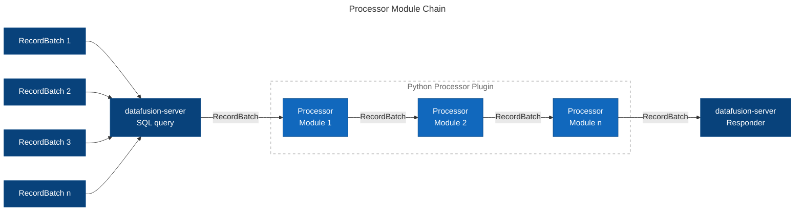

# Distribution Guide for datafusion-server v0.6.x

## Docker container

### Distributed editions

| File                                         | Feature                                                        |
|----------------------------------------------|----------------------------------------------------------------|
| datafusion-server-0.6.x.tar.gz                     | with Python data source connector and processor plugin feature |
| datafusion-server-0.6.x-without-plugin.tar.gz [^1] | basic data source connector                                    |

[^1]: Often not to be created

### Pre-requirement

* Docker Engine v20.0+

### Loading container image

```sh
$ docker load -i datafusion-server-0.6.x.tar.gz
```

### Running container

```sh
$ docker run --rm \
    -p 4000:4000 \
    -v ./data:/var/datafusion-server/data \
    --name datafusion-server \
    datafusion-server:0.6.x
```

* Omit `-v ./data:/var/datafusion-server/data` when using bundled test data

## Windows

### Distributed editions

| File                                                 | Feature                                           |
|------------------------------------------------------|---------------------------------------------------|
| datafusion-server-0.6.x-for-windows-x64.zip                | with Python data source connector plugin feature  |
| datafusion-server-0.6.x-without-plugin-for-windowd-x64.zip | basic data source connector                       |

### Supported Platforms

* Windows 10+ (64bit)
* Windows Server 2016+ (64bit)

### Pre-requirement

* Python 3.7+ Interpreter (only with-plugin)
  + [Python v3.11.3 Official Installer for Windows x64](https://www.python.org/ftp/python/3.11.3/python-3.11.3-amd64.exe)

### Install

Unzip `datafusion-server-0.6.x-for-windowd-x64.zip` or `datafusion-server-0.6.x-without-plugin-for-windowd-x64.zip` to any folder.

### Executing datafusion-server

```sh
$ cd <unzipped-folder>
$ datafusion-server
```

## Testing datafusion-server with bundled example data

* JSON file query

```sh
$ curl -X "POST" "http://localhost:4000/dataframe/query" \
     -H 'Content-Type: application/json' \
     -d $'
{
  "dataSources": [
    {
      "name": "entry",
      "format": "json",
      "location": "file:///public-apis.json"
    }
  ],
  "query": {
    "sql": "SELECT * FROM entry WHERE \"Cors\"=\"yes\""
  },
  "response": {
    "format": "json"
  }
}'
```

* Python data source plugin example query (only for using `datafusion-server-0.6.x-for-windowd-x64.zip` or `datafusion-server-0.6.x.tar.gz`)

```sh
$ curl -X "POST" "http://localhost:4000/dataframe/query" \
     -H 'Content-Type: application/json' \
     -d $'
{
  "dataSources": [
    {
      "format": "arrow"
      "location": "excel://example-workbook.xlsx/Sheet1",
      "name": "example",
      "pluginOptions": {
        "skipRows": 2
      },
    }
  ],
  "query": {
    "sql": "SELECT * FROM example"
  },
  "response": {
    "format": "json"
  }
}'
```

* Python processor plugin example query (only for using `datafusion-server-0.6.x.zip` or `datafusion-server-0.5.x.tar.gz`)

```sh
$ curl -X "POST" "http://localhost:4000/dataframe/query" \
     -H 'Content-Type: application/json' \
     -d $'
{
  "dataSources": [
    {
      "format": "csv",
      "name": "superstore",
      "location": "file:///superstore.csv",
      "options": {
        "hasHeader": true
      }
    }
  ],
  "query": {
    "sql": "SELECT * FROM superstore",
    "postProcessors": [
      {
        "module": "pivot-table",
        "pluginOptions": {
          "values": "Sales",
          "index": ["State", "City"],
          "columns": "Department"
        }
      }
    ]
  },
  "response": {
    "format": "json"
  }
}'
```

Multiple modules can be chained.



---